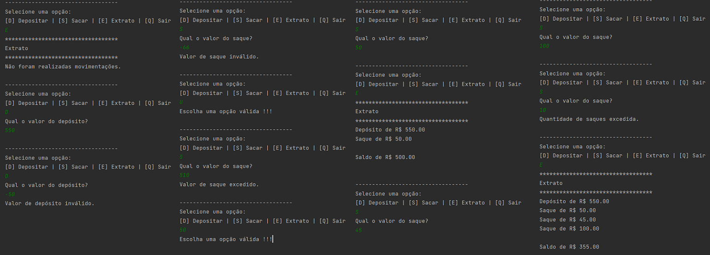

# Projeto 1 - Criando um Sistema Bancário com Python

O Desafio do Projeto é criar um sistema bancário com as operações: sacar, depositar e visualizar extrato.

Obs.: Alguns projetos apresentados depois consistem em aperfeiçoar este projeto, 
então o uso de funções e POO são reduzidos aqui para buscar mais simplicidade.

## Regras de Negócio
As regras de negócio do projeto são:
* Para este sistema, devemos implementar apenas 3 operações: depósito, saque e extrato.
* Esta versão considera apenas um usuário.
* Todos os depósitos devem ser armazenados em uma variável e exibidos na operação de extrato.
* O sistema deve permitir realizar 3 saques diários com limite máximo de R$ 500,00 por saque.
* Caso o usuário não tenha saldo em conta, o sistema deve exibir uma mensagem informando que 
não será possível sacar o dinheiro por falta de saldo. 
* Todos os saques devem ser armazenados em uma variável e exibidos na operação de extrato.
* O extrato deve listar todos os depósitos e saques realizados na conta.
* No fim da listagem deve ser exibido o saldo atual da conta. 
* Se o extrato estiver em branco, exibir a mensagem: `Não foram realizadas movimentações.`.
* Os valores devem ser exibidos utilizando o formato R$ xxx.xx.

## Exemplo de Execução
O sistema é executado direto pelo arquivo `Sistema_Bancario.py`. 

Um exemplo de execução:

## Referências

DIO - Formação Python Developer:
https://web.dio.me/track/formacao-python-developer
, Acessado em 04/05/2023.