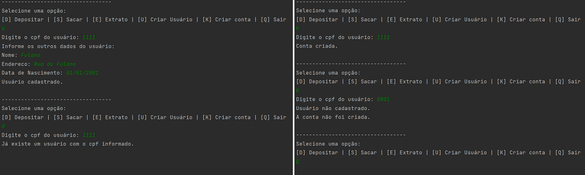

# Projeto 2 - Otimizando o Sistema Bancário com Funções Python

O Desafio do Projeto é refatorar o Projeto 1 (Criando um Sistema Bancário com Python) modularizando o sistema.

Obs.: Um projeto apresentado depois consiste em aperfeiçoar este projeto, então não houve o uso de POO neste.

## Requisitos do Projeto
Além da implementação das regras de negócio do projeto anterior, os requisitos de implementação a seguir foram satisfeitos:
- Deixar o código mais modularizado.
- Criar funções para as operações existentes: sacar, depositar e visualizar extrato.
- Cada função vai ter uma regra na passagem de argumentos. 
- O retorno e a forma como as funções serão chamadas, pode ser definida por você da forma que achar melhor.
- A função saque deve receber os argumentos apenas por nome (keyword only). 
  * Sugestão de argumentos: saldo, valor, extrato, limite, número_saque, limite_saques. 
  * Sugestão de retorno: saldo e extrato.
- A função depósito deve receber os argumentos apenas por posição (positional only). 
  * Sugestão de argumentos: saldo, valor, extrato. 
  * Sugestão de retorno: saldo e extrato.
- A função extrato deve receber os argumentos por posição e nome (positional only e keyword only). 
  * Argumentos posicionais: saldo, argumentos nomeados: extrato.
- Precisamos criar duas novas funções: 
  * criar usuário (cadastrar usuário ou cliente)
  * criar conta corrente (cadastrar conta bancária). 
- Pode adicionar mais funções como listar contas.

## Exemplo de Execução
O sistema é executado direto pelo arquivo `Sistema_Bancario_v2.py`. 

Um exemplo de execução:

## Referências

DIO - Formação Python Developer:
https://web.dio.me/track/formacao-python-developer
, Acessado em 05/05/2023.